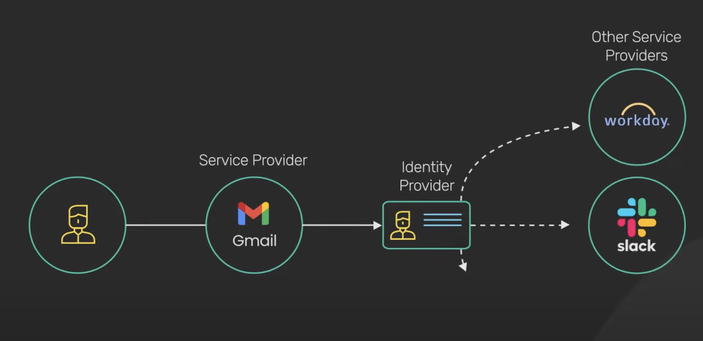
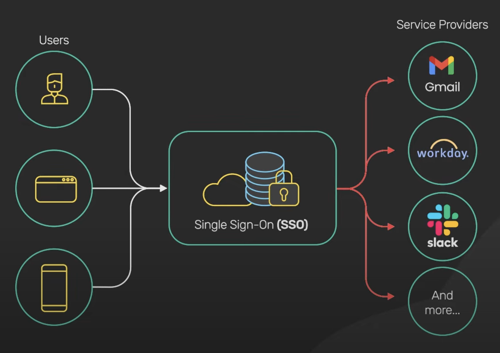
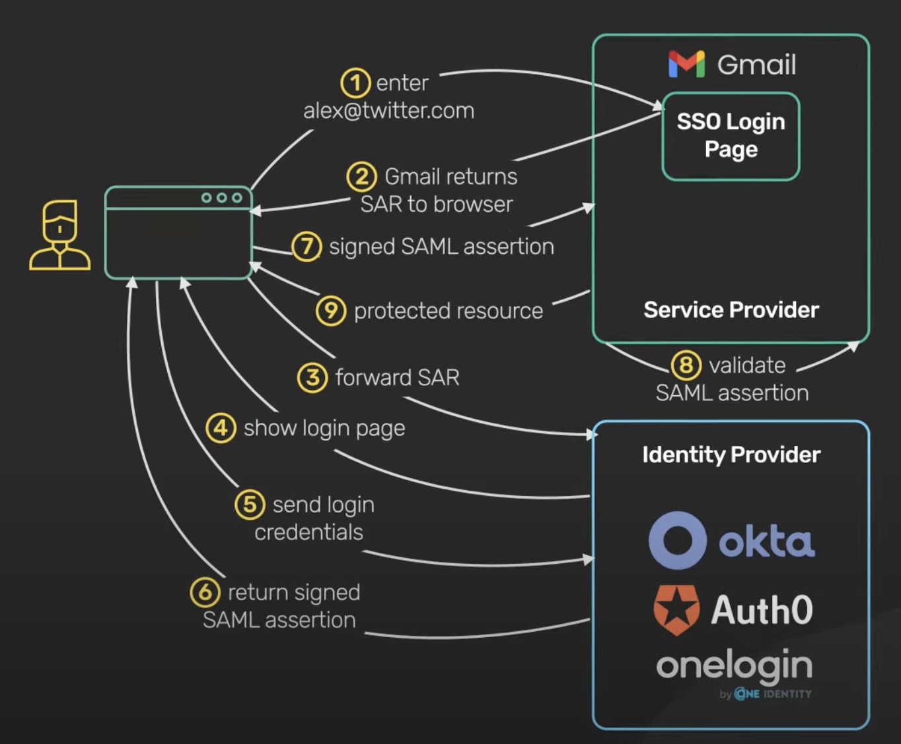

# SSO

## Resources

- [What is Single Sign On](https://www.youtube.com/watch?v=Bv6NZlqqn48)
- [How Single Sign On Works?](https://www.youtube.com/watch?v=O1cRJWYF-g4)

## Basics

SSO is an authentication scheme. It enables a user to securely access multiple applications and services using a single ID.

SSO is built on a concept of federated identity. It enables sharing of identity information across trusted but independent systems.

There are two common protocols for this authentication process.

- **SAML** - `XML-based` open standard for exchanging identity information between services.
- **OpenID Connect** - It uses JWT, to share identity information between services.

## SSO Workflow

