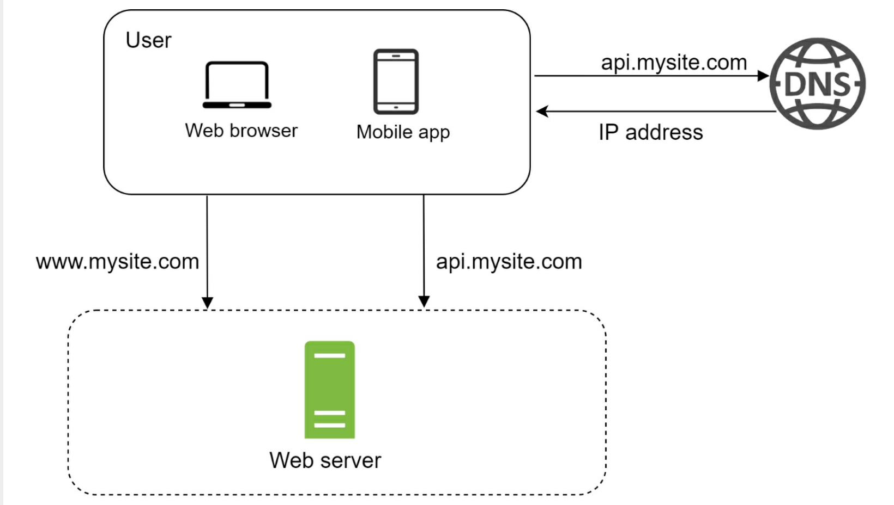
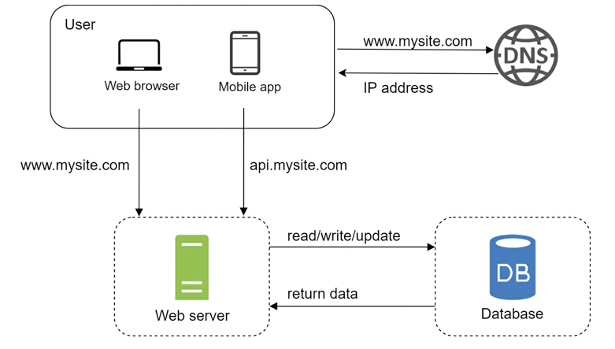
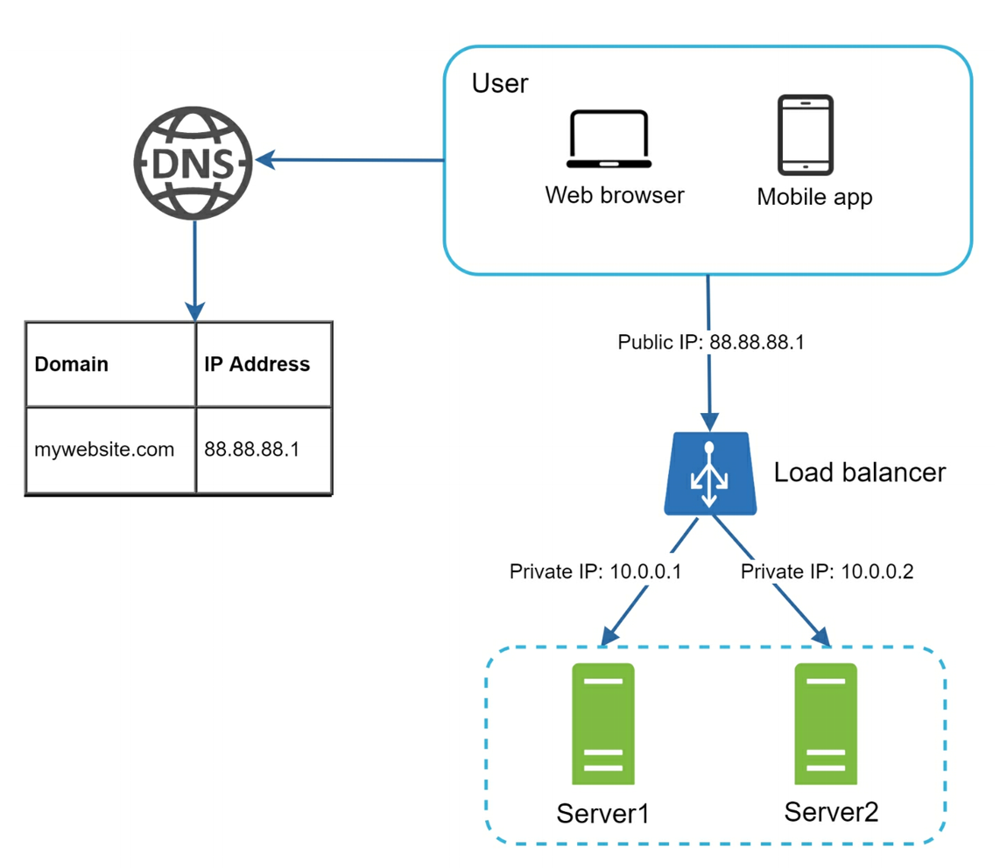
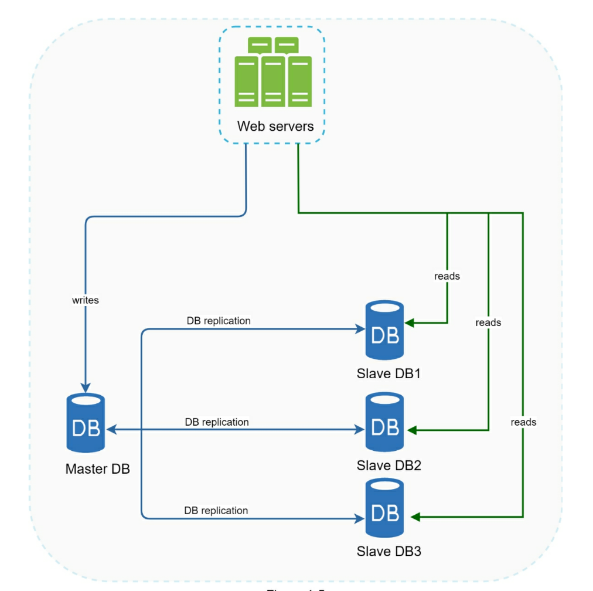
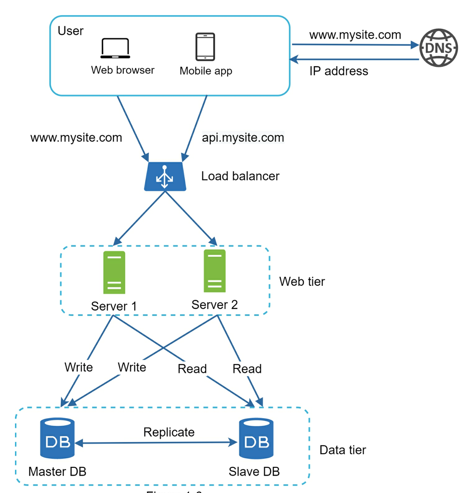
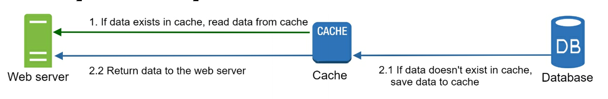
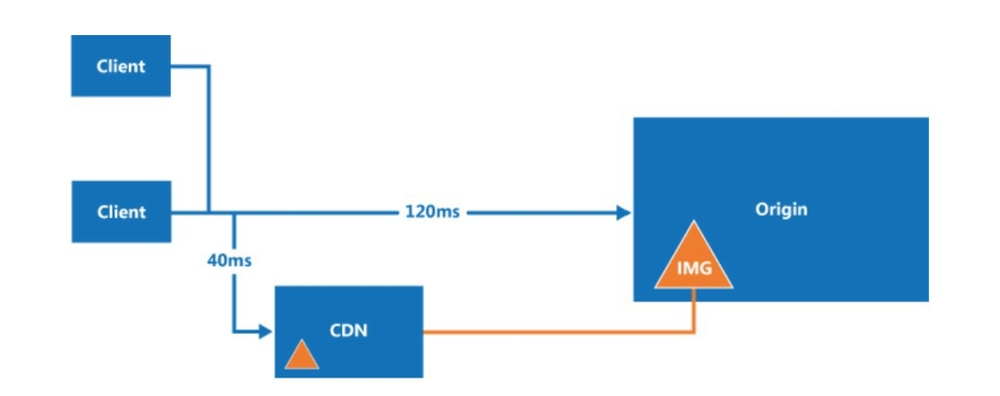
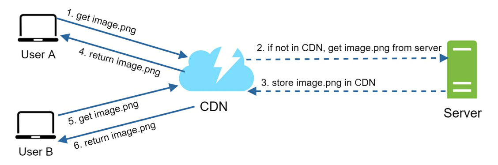

# Basics

## Single Server Setup



Everything running on a single server: web app, database, cache, etc.

- Users access websites through domain names, such as `api.mysite.com`.
- The IP address is returned to the browser or mobile app.
- Once the IP address is obtained, HTTP requests are sent directly to your web server. 
- The web server returns HTML pages or JSON response for rendering.

The traffic to the web server comes from the web application or the mobile application.

## An example of API response in JSON format

```json
{
    "id": 12,
    "name": "John",
    "lastName": "Smith",
    "address": {
        "city": "New York",
        "state": "NY"
    },
    "phoneNumbers": [
        "212 555-1234",
        "646 555-4567"
    ]
}
```

## Database

With growing traffic, we need multiple servers: one for web/mobile traffic, the other for the database. Separating web/mobile traffic (web tier) and database (date tier) allows them to be scaled independently.



<b>Which database to use?</b>

Non-relational databases might be the right choice if:

- Your application requires super-low latency.
- Your data is unstructured, or you do not have any relational data.
- You only need to serialize and deserialize data. 

## Vertical scaling vs. Horizontal scaling

Vertical scaling, means the process of adding more power (CPU, RAM, etc.) to your servers. Horizontal scaling, allows you to scale by adding more servers into your pool of resources.

When traffic is low, vertical scaling is a great option, and the simplicity of vertical scaling is its main advantage. However, there are limitations.

- Vertical scaling has a hard limit. It is impossible to add unlimited CPU and memory to a single server.
- Vertical scaling does not have failover and redundancy. If one server goes down, the website/app goes down with it completely.

Horizontal scaling is more desirable for large scale applications due to the limitations of vertical scaling.

Users will be unable to access the website if the web server is offline. In another scenario, if many users access the web server simultaneously and it reaches the web server's load limit, users generally experience higher response time or fail to connect to the server. 

## Load Balancer

A load balancer evenly distributes incoming traffic among web servers that are defined in a load-balanced set. 



Users connect to the public IP of the load balancer directly. With this setup, web servers are unreachable directly by clients anymore. For better security, private IPs are used for communication between servers. A private IP is an IP address reachable only between servers in the same network; however, it is unreachable over the internet. The load balancer communicates with web servers through private IPs. 

- If server 1 goes offline, all the traffic will be routed to server 2. This prevents the website from going offline. We will also add a new healthy web server to the server pool to balance the load.
- If the website traffic grows rapidly, and two servers are not enough to handle the traffic, the load balancer can handle this problem gracefully. You only need to add more servers to the web server pool, and the load balancer automatically starts to send requests to them.

## Database replication

A master database generally only supports write operations. A slave database gets copies of the data from the master database and only supports read operations. Most applications require a much higher ratio of reads to writes; thus, the number of slave databases in a system is usually larger than the number of master databases.



- If only one slave database is available and it goes offline, read operations will be directed to the master database temporarily.
- If the master database goes offline, a slave database will be promoted to be the new master. All the database operations will be temporarily executed on the new master database.



## Cache

A cache is a temporary storage area that stores the result of expensive responses or frequently accessed data in memory so that subsequent requests are served more quickly. The application performance is greatly affected by calling the database repeatedly. The cache can mitigate this problem.



**Considerations for using cache**

- Mitigating failures: A single cache server represents a single point of failure (SPOF). As a result, multiple cache servers across different data centers are recommended to avoid SPOF. Another recommended approach is to overprovision the required memory by certain percentages.
- Eviction Policy: Once the cache is full, any requests to add items to the cache might cause existing items to be removed. This is called cache eviction. Least-recently used (LRU) is the most popular cache eviction policy. Other eviction policies, such as the Least Frequently Used (LFU) or First In First Out (FIFO), can be adopted to satisfy use cases.

## Content Delivery Network (CDN)

A CDN is a network of geographically dispersed servers used to deliver static content. CDN servers cache static content like images, videos, CSS, JavaScript files, etc.





- User A tries to get `image.png` by using an image URL. The URL's domain is provided by the CDN provider.
- If the CDN server does not have `image.png` in the cache, the CDN server requests the file from the origin, which can be a web server or online storage like AWS S3.
- The origin returns `image.png` to the CDN server, which includes optional HTTP header Time-to-Live (TTL) which describes how long the image is cached.
- The CDN caches the image and returns it to User A. The image remains cached in the CDN until the TTL expires.
- User B sends a request to get the same image.
- The image is returned from the cache as long as the TTL has not expired.

**Considerations for using a CDN**

- Cost: CDNs are run by third-party providers, and you are charged for data transfers in and out of the CDN. Caching infrequently used assets provides no significant benefits so you should consider moving them out of the CDN.
- Setting an appropriate cache expiry: The cache expiry time should neither be too long nor too short. If it is too long, the content might no longer be fresh. If it is too short, it can cause repeat reloading of content from origin servers to the CDN.
- CDN fallback: You should consider how your website/application copes with CDN failure. If there is a temporary CDN outage, clients should be able to detect the problem and request resources from the origin.
- Invalidating files: You can remove a file from the CDN before it expires by performing one of the following operations:
  - Invalidate the CDN object using APIs provided by CDN vendors.
  - Use object versioning to serve a different version of the object. 

## Stateless Web tier

## Data centers

## Message Queues

## Logging, Metrics, and Automation

## Database Scaling

## Millions of users and beyond 
