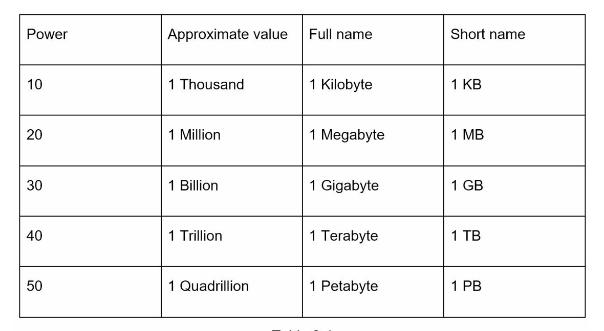
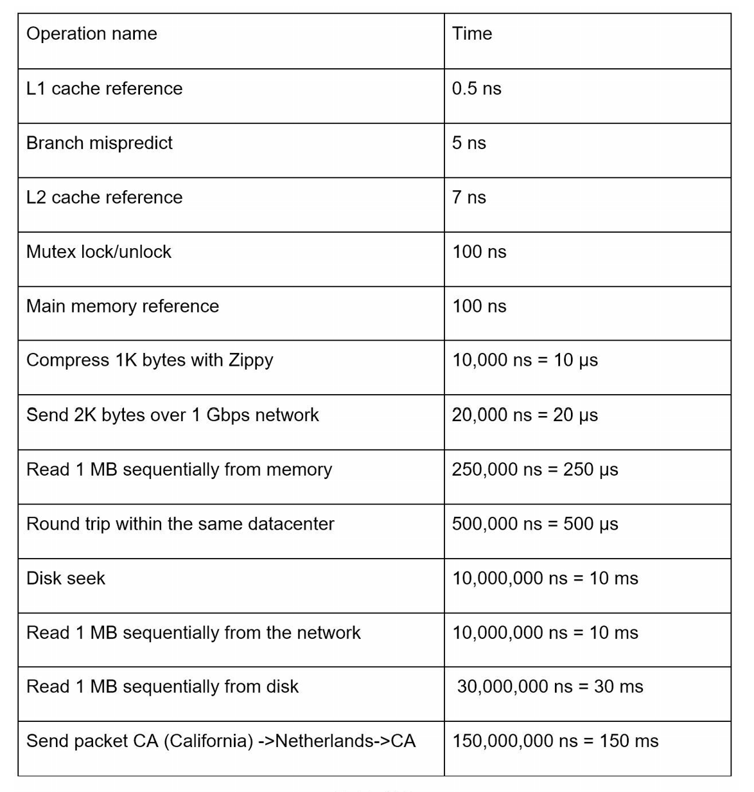

# Estimation

Back-of-the-envelope calculations are the estimates you create using a combination of thought experiments and common performance numbers to get a good feel for which designs will meet your requirements.

## Power of two

To obtain correct calculations, it is critical to know the data volume unit using the power of 2. A byte is a sequence of 8 bits. An ASCII character uses one byte of memory (8 bits).

## Latency numbers every programmer should know

By analyzing the numbers we get the following conclusions:

- Memory is fast but the disk is slow.
- Avoid disk seeks if possible.
- Simple compression algorithms are fast.
- Compress data before sending it over the internet if possible.
- Data centers are usually in different regions, and it takes time to send data between them.

## Availability numbers

## Example: Estimate Twitter QPS and Storage requirements

## Tips
