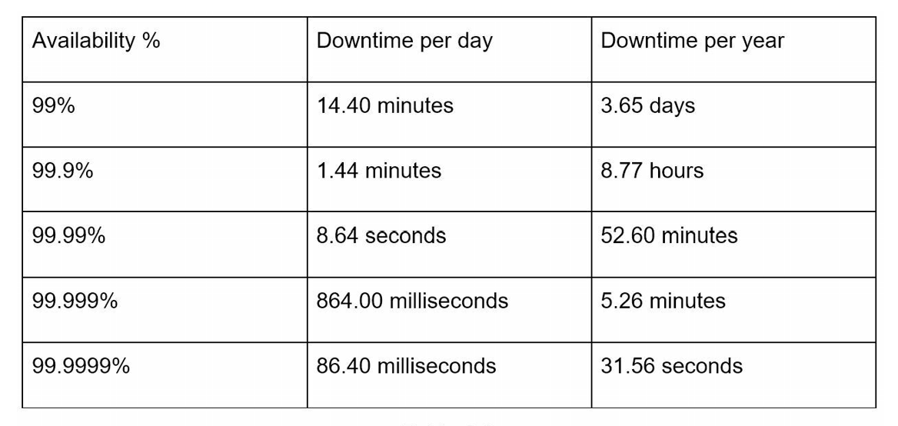

# Estimation

Back-of-the-envelope calculations are the estimates you create using a combination of thought experiments and common performance numbers to get a good feel for which designs will meet your requirements.

## Power of two

To obtain correct calculations, it is critical to know the data volume unit using the power of 2. A byte is a sequence of 8 bits. An ASCII character uses one byte of memory (8 bits).

## Latency numbers every programmer should know

By analyzing the numbers we get the following conclusions:

- Memory is fast but the disk is slow.
- Avoid disk seeks if possible.
- Simple compression algorithms are fast.
- Compress data before sending it over the internet if possible.
- Data centers are usually in different regions, and it takes time to send data between them.

## Availability numbers

High availability is the ability of a system to be continuously operational for a desirably long period of time. High availability is measured as a percentage, with 100% means a service has 0 downtime.

A service level agreement (SLA) is a commonly used term for service providers. This is an agreement between you (the service provider) and your customer, and this agreement formally defines the level of uptime your service will deliver.

## Example: Estimate Twitter QPS and Storage requirements

Assumptions:

- 300 million monthly active users.
- 50% of users use Twitter daily.
- Users post 2 tweets per day on average.
- 10% of tweets contain media.
- Data is stored for 5 years.

Estimations:

- Query per second (QPS) estimate:
  - Daily active users (DAU) = 300 million * 50% = 150 million
  - Tweets QPS = (150 million * 2 tweets) / 24 hour / 3600 seconds = ~3500
  - Peak QPS = 2 * QPS = ~7000
- Storage estimate:
  - Average tweet size:
    - tweet_id 64 bytes
    - text     140 bytes
    - media    1 MB
  - Media storage = 150 million * 2 * 10% * 1 MB = 30 TB per day
  - 5-year media storage = 30 TB * 365 * 5 = ~55 PB

## Tips
