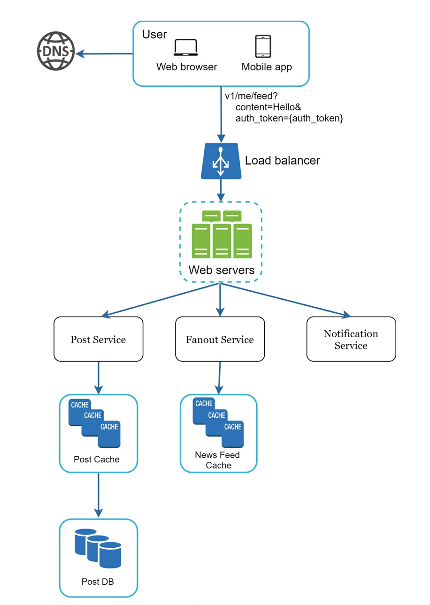
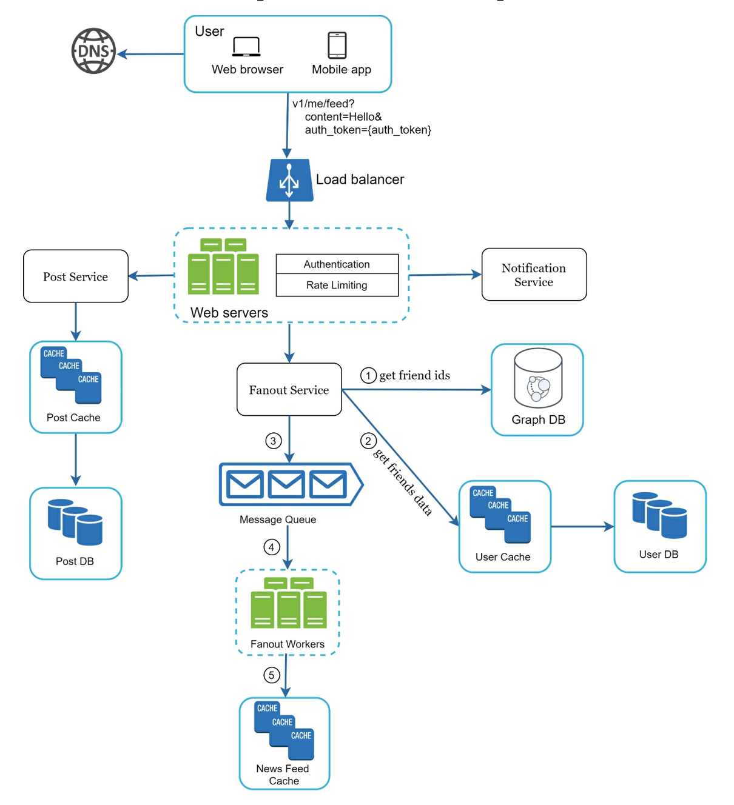
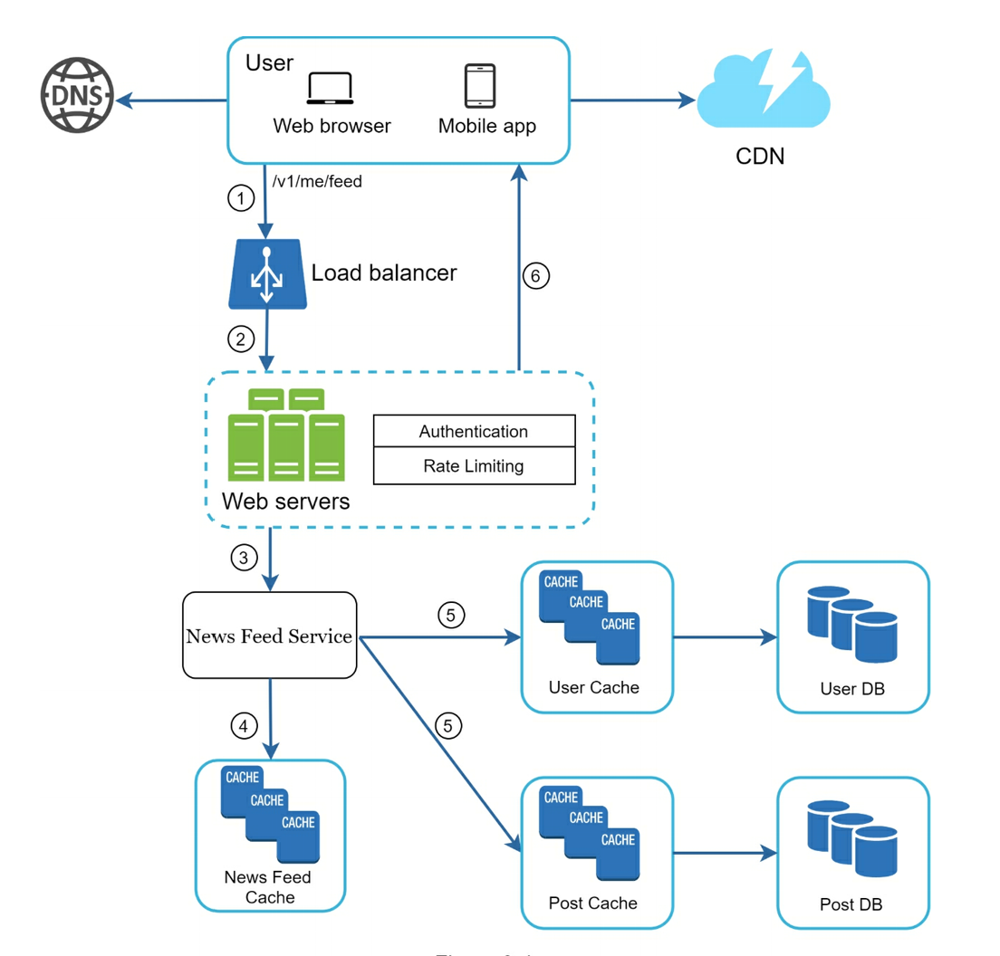

# A Framework for System Design Interviews

The system design interview simulates real-life problem solving where two co-workers collaborate on an ambiguous problem and come up with a solution that meets their goals. The problem is open-ended, and there is no perfect answer.

An effective system design interview gives strong signals about a person's ability to collaborate, to work under pressure, and to resolve ambiguity constructively. The ability to ask good questions is also an essential skill, and many interviewers specifically look for this skill.

Avoid over-engineering. Write down trade-offs.

## A 4-step process for effective System Design interview

### Step 1 - Understand the problem and establish design scope

In a system design interview, giving out an answer quickly without thinking gives you no bonus points. Answering without a thorough understanding of the requirements is a huge red flag as the interview is not a trivia contest. 

**Think deeply and ask questions to clarify the requirements and assumptions.**

Write down your assumptions on the whiteboard or paper. You might need them later.

A list of questions to get started:

- What specific features are we going to build?
- How many users does the product have?
- How fast does the company anticipate to scale up?
- What existing services you might leverage to simplify the design?

Sample questions to ask an interviewer for designing a News Feed:

- Is this a mobile app? Or a web app? Or both?
- Is the news feed sorted in reverse chronological order or a custom order? Custom order means each post is given a different weight. For instance, posts from your close friends are more important than posts from a group.
- What is the traffic volume?
- Can the feed contain images, videos, or just text?

### Step 2 - Propose high-level design and get buy-in

- Come up with a initial blueprint for the design. Ask for feedback. Treat your interviewer as a teammate and work together.
- Draw box diagrams with key components on the whiteboard or paper.
- Do back-of-the-envelope calculations to evaluate if your blueprint fits the scale constraints.

#### Example - Design a News Feed System

At the high level, the design is divided into two flows: feed publishing and news feed building.

- Feed publishing: when a user publishes a post, corresponding data is written into cache/database, and the post will be populated into friends' news feed.
- Newsfeed publishing: the news feed is built by aggregating friends' posts in a reverse chronological order.

### Step 3 - Design deep dive

You shall work with the interviewer to identify and prioritize components in the architecture. Sometimes, for a senior candidate interview, the discussion could be on the system performance characteristics, likely focusing on the bottlenecks and resource estimations. 

For URL shortener, it is interesting to dive into the hash function design that converts a long URL to a short one. For a chat system, how to reduce latency and how to support online/offline status are two interesting topics.

Time management is essential as it is easy to get carried away with minute details that do not demonstrate your abilities.

#### Example - Investigating two of the most important use cases

1. Feed publishing
2. News feed retrieval

### Step 4 - Wrap up

#### Dos

- Always ask for clarification. Do not assume your assumption is correct.
- Understand the requirements of the problem.
- There is neither the right answer not the best answer. A solution designed to solve the problems of a young startup is different from that of an established company with millions of users.
- Communicate with your interviewer.
- Suggest multiple approaches if possible.
- Design the most critical components first.
- Never give up.

#### Don'ts

- Don't be unprepared for typical interview questions.
- Don't jump into a solution without clarifying the requirements and assumptions.
- Don't go into too much detail on a single component.
- If you get stuck, don't hesitate to ask for hints.
- Don't think in silence.
- Ask for feedback early and often.

## Time allocation on each step

- Step 1 Understand the problem and establish design scope: 3-10 minutes
- Step 2 Propose high-level design and get buy-in: 10-15 minutes
- Step 3 Design deep dive: 10-25 minutes
- Step 4 Wrap: 3-5 minutes
