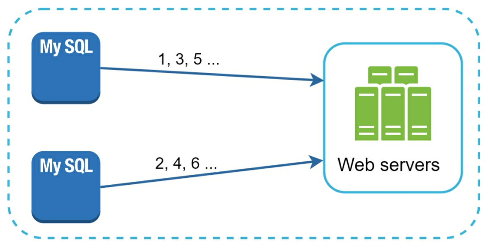
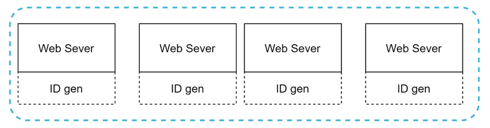
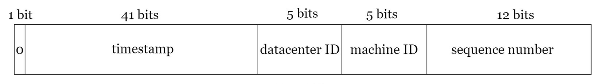
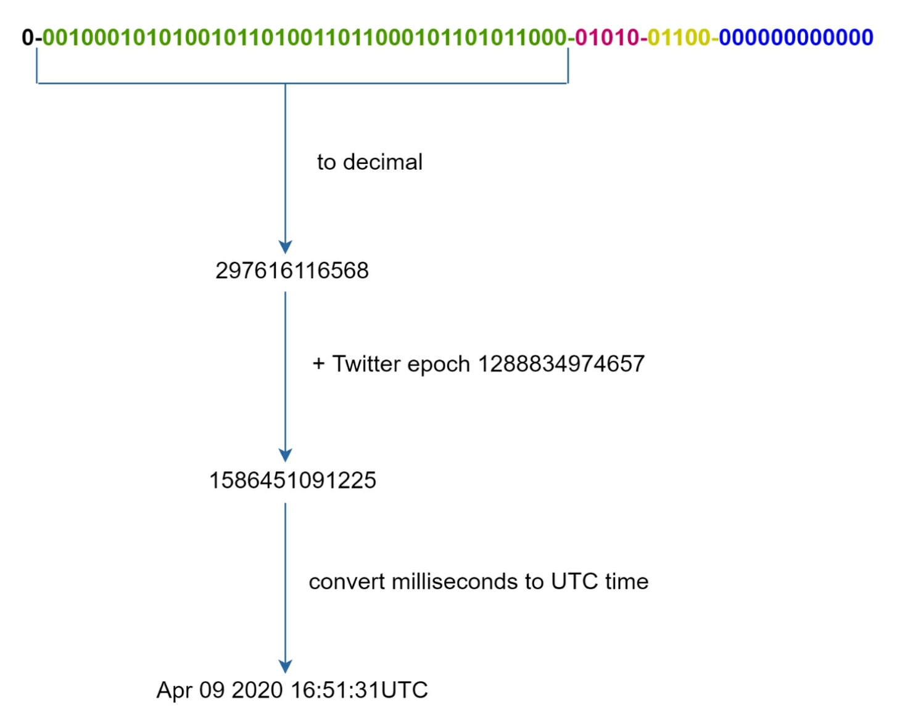

# Unique ID Generator

## Requirements

- IDs must be unique.
- IDs are numerical values only.
- IDs fit into 64-bit.
- IDs are ordered by date.
- Ability to generate over 10000 unique IDs per second.

## High-Level Design

Multiple options can be used to generate unique IDs in distributed systems.

**Multi-master replication**

This approach uses the databases' *auto_increment* feature. Instead of increasing the next ID by 1, we increase it by *k*, where k is the number of database servers in use. This solves some scalability issues because IDs can scale with the number of database servers. However, this strategy has some major drawbacks:

- Hard to scale with multiple data centers.
- IDs do not go up with time across multiple servers.
- It does not scale well when a server is added or removed.

**UUID**

UUID is a 128-bit number used to identify information in computer systems. UUID has a very low probability of getting collusion. UUIDs can be generated independently without coordination between servers.

In this design, each web server contains an ID generator, and a web server is responsible for generating IDs indenpendently.

Pros:

- Generating UUIDs is simple. No coordination between servers is needed so there will not be any synchronization issues.
- The system is easy to scale because each web server is responsible for generating IDs they consume. ID generator can easily scale with web servers.

Cons:

- IDs are 128 bits long, but our requirement is 64 bits.
- IDs do not go up with time.
- IDs could be non-numeric.

**Twitter Snowflake**

Instead of generating an ID directly, we divide an ID into different sections.

- **Sign bit**: 1 bit. It will always be 0. This is reserved for future uses. It can potentially be used to distinguish between signed and unsigned numbers.
- **Timestamp**: 41 bits. Milliseconds since the epoch or custom epoch.
- **Datacenter ID**: 5 bits. This gives us *2 ^ 5 = 32* datacenters.
- **Machine ID**: 5 bits. This gives us *2 ^ 5 = 32* machines per datacenter.
- **Sequence number**: 12 bits. For every ID generated on that machine/process, the sequence number is incremented by 1. The number is reset to 0 every millisecond.

## Design deep dive

Datacenter IDs and machine IDs are chosen at the startup time, generally fixed once the system is up and running. Any change in datacenter IDs and machine IDs require careful review since an accidental change in those values can lead to ID conflicts. 

**Timestamp**

As timestamps grow with time, IDs are sortable by time. 

The maximum timestamp that can be represented in 41 bits is *2 ^ 41 - 1*, which gives us ~ 69 years. This means the ID generator will work for 69 years and having a custom epoch time close to today's date delays the overflow time. 

**Sequence number**

Sequence number is 12 bits, which gives us 2 ^ 12 = 4096 combinations. This field is 0 unless more than one ID is generated in a millisecond on the same server. In theory, a machine can support a maximum of 4096 new IDs per millisecond.
