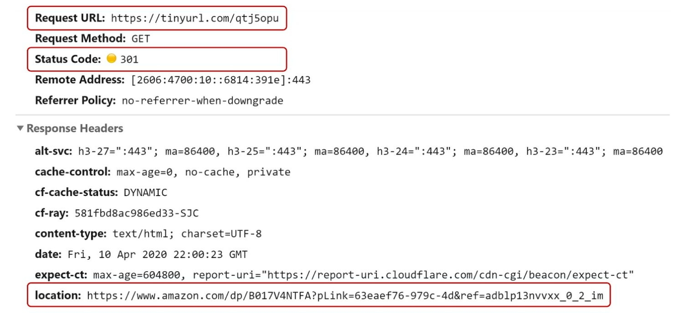
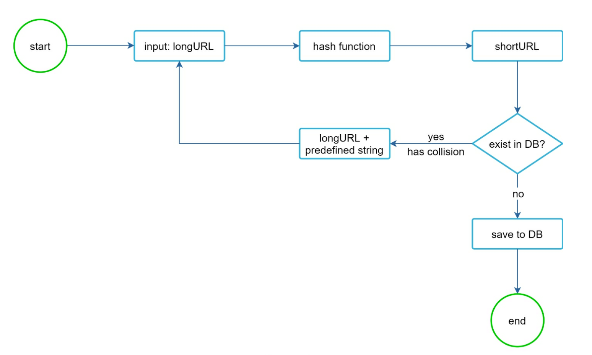
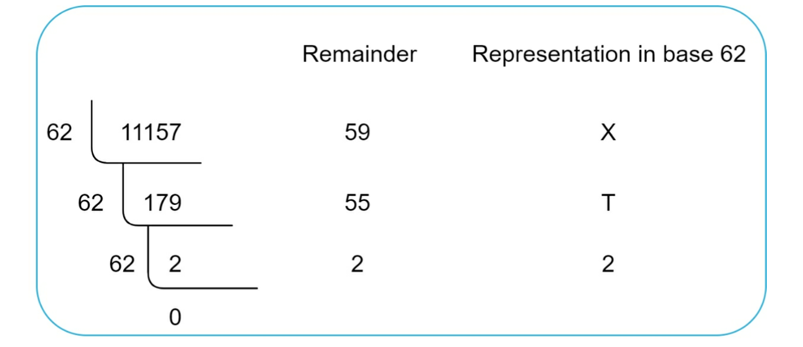
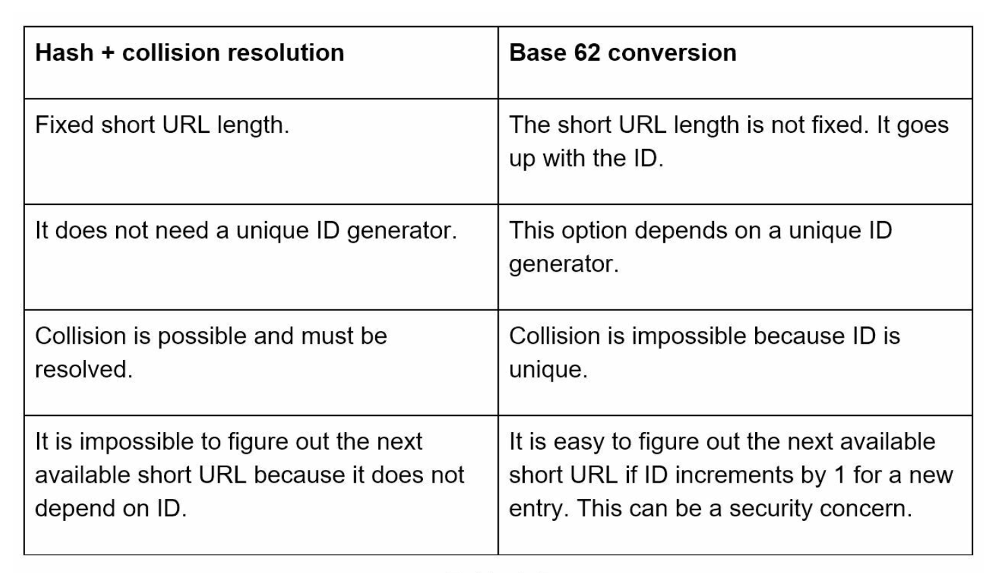
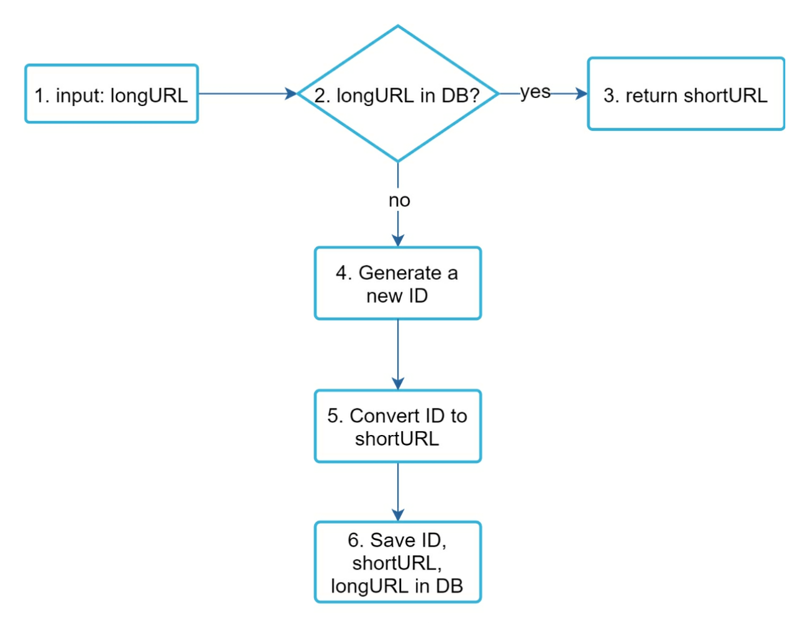
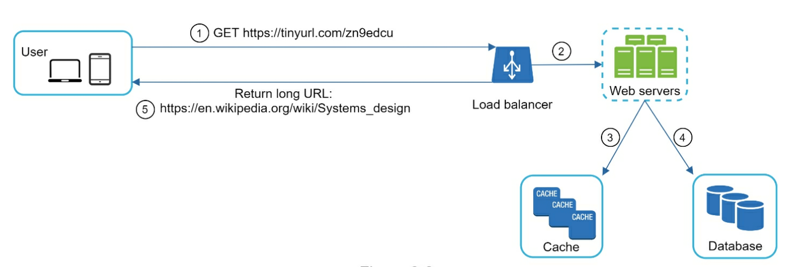

# URL Shortener

## Use Cases

- URL Shortening: Long URL => Short URL
- URL Redirecting: Short URL => Long URL
- High Availability, Scalability, and Fault Tolerance

## Back of the Envelope Estimation

- Write Operation: **100 million URLs/day**
- Write Operation/Sec: **100 million/24/3600 = 1160**
- Read Operation/Sec (assuming ratio of Read to Write as 10:1): **1160 * 10 = 11600**
- Number of Records (assuming service will run for 10 years): **100 million * 365 * 10 = 365 billion records**
- Storage requirement (assuming average length of URL is 100 bytes): **365 billion * 100 bytes = 36.5 TB**

## API Endpoints

**URL Shortening**

```text
POST api/v1/data/shorten

- Request Parameter: {longUrl: longURLString}
- Return shortURL
```

**URL Redirecting**

```text
GET api/v1/{shortURL}

- Return longURL for HTTP redirection
```

## URL Redirecting



Once the server receives a tinyurl request, it changes the short URL to the long URL with 301 redirect.

**301 redirect**

A 301 redirect shows that the requested URL is "permanently" moved to the long URL. Since it is permanently redirected, the browser caches the response, and subsequent requests for the same URL will not be sent to the URL shortening service. Instead, requests are redirected to the long URL directly.

If the priority is to reduce the server load, using 301 redirect makes sense as only the first request of the same URL is sent to URL shortening servers.

**302 redirect**

A 302 redirect means that the URL is "temporarily" moved to the long URL, meaning that subsequent requests for the same URL will be sent to the URL shortening service first. 

If analytics is important, 302 redirect is a better choice as it can track click rate and source of the click more easily.

## URL Shortening

To support the URL Shortening use case, we must find a hash function *fx* that maps a long URL to the *HashValue*.


The hash function must satisfy the following requirements:

- Each *LongURL* must be hashed to one *HashValue*.
- Each *HashValue* can be mapped back to the *LongURL*.

## Data Model

**URL Table**

| column | data type |
|---|---|
| id | PK |
| short_url | VARCHAR |
| long_url | VARCHAR |

## Hash Function

Hash function is used to hash a long URL to a short URL, also known as a *hash value*.

**Hash value length**

The hash value consists of characters from [0-9, a-z, A-Z], containing 62 possible characters. To figure out the length of hash value, find the smallest *n* such that *62^n >= 365 billion*. 

| n | Maximal number of URLs |
|---|---|
| 1 | 62^1 = 62 |
| 2 | 62^2 = 3844 |
| 3 | 62^3 = 238328 |
| 4 | 62^4 = 14776336 |
| 5 | 62^5 = 916132832 |
| 6 | 62^6 = 56800235584 |
| 7 | 62^7 = 3521614606208 = ~3.5 trillion |
| 8 | 62^8 = 218340105584896 |

When *n = 7, 62^n = ~3.5 trillion*, this is more than enough to hold 365 billion URLs, so the length of the hash value is 7.

To shorten a long URL, we should implement a hash function that hashes a long URL to a 7-character string.

**Approach 1: Hash + Collision resolution**

The first approach is to collect the first 7 characters of a hash value; however, this method can lead to hash collisions. To resolve hash collisions, we can recursively append a new predefined string until no more collision is discovered. 



This method can eliminate collision; however, it is expensive to query the database to check if a short URL exists for every request.

**Approach 2: Base62 Conversion**

Base conversion helps to convert the same number between its different number representation systems. Base 62 conversion is used as there are 62 possible characters for *hash value*. 

- From its name, Base 62 is a way of using 62 characters for encoding. The mappings are: 0-0, ..., 9-9, 10-a, 11-b, ..., 35-z, 36-A, ..., 61-Z, where 'a' stands for 10, 'Z' stands for 61, etc.
- 11157<sub>10</sub> = 2 x 62<sup>2</sup> + 55 x 62<sup>1</sup> + 59 x 62<sup>0</sup> = [2, 55, 59] -> [2, T, X] in Base 62 representation.
- Thus, the short URL is https://tinyurl.com/2TX.



**Comparison of the two approaches**



## URL Shortener Deep Dive



**Example**

- Assuming the input long url is: https://en.wikipedia.org/wiki/Systems_design
- Unique ID Generator returns ID: 2009215674938
- Convert the ID to short url using the Base 62 conversion. ID (2009215674938) is converted to `zn9edcu`.
- Save ID, short url, and long url in the database.

| id | short_url | long_url |
|---|---|---|
| 2009215674938 | zn9edcu | https://en.wikipedia.org/wiki/Systems_design |

## URL Redirecting Deep Dive



As there are more reads than writes, *<shortUrl, longUrl>* mapping is stored in a cache to improve performance.
